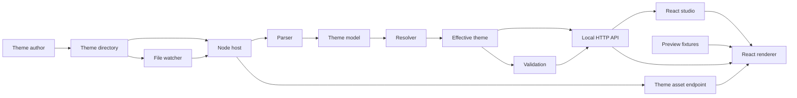
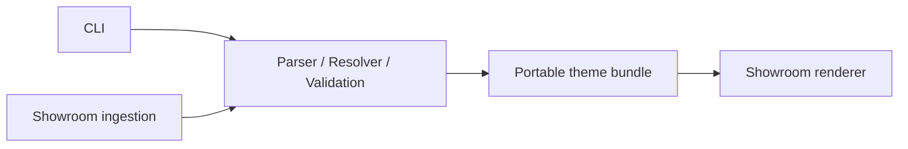
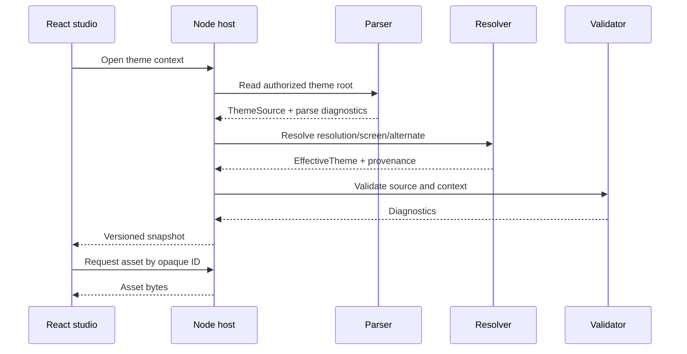
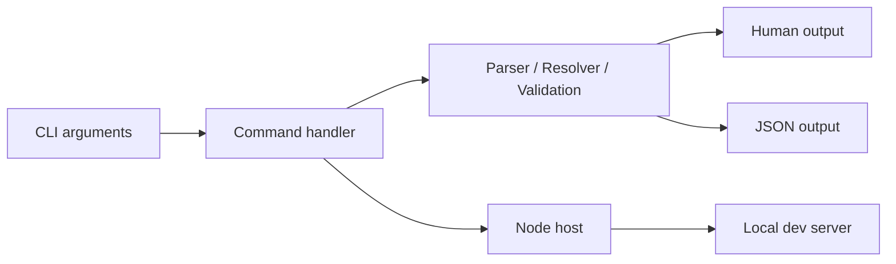

# muxpreview Architecture

## 1. Status

This document proposes the architecture for `muxpreview`, based on the evidence
and uncertainty boundaries in `RESEARCH.md`.

It is a design document, not an implementation specification. Names and package
boundaries may change during implementation, but the separation of concerns
should remain unless new evidence from muOS requires a different model.

## 2. Product definition

`muxpreview` is a local development environment for inspecting and previewing
muOS themes in a browser.

The initial product should:

- open an unpacked theme directory
- inspect its metadata, resolutions, schemes, fonts, glyphs, images, sounds,
  alternates, and diagnostics
- render representative muOS-like screens in a browser
- reload when theme files change
- explain which source files and values produced the preview

The architecture must also support:

- a future command-line interface
- future validation in local and automated workflows
- a future public showroom for published themes

The project must not claim device-perfect emulation where the reference files
do not establish muOS behavior.

## 3. Architectural principles

### 3.1 Evidence before emulation

The system distinguishes:

- **observed** behavior directly represented by theme files
- **inferred** behavior implemented as a documented compatibility rule
- **approximate** behavior used when browser limitations prevent fidelity
- **unknown** behavior that is not implemented as fact

Every inferred compatibility rule should be replaceable and testable.

### 3.2 One domain model, multiple hosts

Theme parsing, normalization, resolution, and diagnostics should be plain
TypeScript packages without React, Node filesystem, HTTP, or CLI dependencies.

The same domain model should support:

- the local Node development server
- the React browser application
- the future CLI
- the future showroom ingestion pipeline

### 3.3 Preserve source information

Normalization must not erase the original data. Effective values should retain:

- source file
- section and key
- original text
- parsed value
- merge layer
- confidence or compatibility-rule identifier

This enables inspection, diagnostics, and future correction of inferred rules.

### 3.4 Permissive parsing, separate validation

The parser should recover as much information as possible from partial and
unfamiliar themes.

Validation is a separate pass. Unknown keys, unknown screen IDs, partial
themes, and unsupported assets should produce diagnostics rather than make the
theme impossible to inspect.

### 3.5 Renderer primitives over screen replicas

The browser renderer should compose reusable primitives:

- canvas and background
- header and status
- footer and navigation
- list
- grid
- current-item label
- image/metadata preview
- modal
- keyboard
- roller
- counter
- progress bar
- transient overlay

Screen definitions select fixtures and primitive arrangements. They do not
pretend that every observed `mux*` identifier has verified runtime behavior.

### 3.6 Local-first, showroom-ready

The local product may use Node filesystem access. Core theme interpretation and
rendering contracts must remain independent of absolute local paths so that a
theme can later be loaded from an uploaded archive or generated static bundle.

## 4. Technology choices

### Required

- React
- TypeScript
- Vite
- Node.js for the local host process

### Proposed supporting choices

- A workspace-based repository with independently testable packages
- Vite middleware mode inside the local Node server
- Server-Sent Events or WebSocket for theme change notifications
- Standard HTTP endpoints for manifests, diagnostics, and assets
- Vitest for unit and integration tests
- React Testing Library for UI behavior
- Playwright for browser rendering and live-reload tests

Package manager, Node version, linting, formatting, and release tooling are not
yet selected. They are implementation decisions, not muOS compatibility
decisions.

### 4.1 Why an embedded Vite server

The browser cannot directly watch arbitrary local theme directories. A Node
process is required to:

- read theme files
- watch for changes
- constrain filesystem access
- expose theme assets over HTTP
- parse and resolve themes
- notify the browser

Embedding Vite as middleware in the same Node process provides:

- React application development and Vite HMR
- one local port
- one lifecycle for the UI and theme watcher
- a clean route boundary between application assets and theme APIs

Vite HMR and theme reload are related but distinct:

- **application HMR** updates muxpreview source code during muxpreview
  development
- **theme reload** updates parsed theme state when a user's theme files change

Theme reload should use a muxpreview protocol rather than pretending theme
files are JavaScript modules.

## 5. Repository layout

Proposed eventual layout:

```text
muxpreview/
|-- apps/
|   |-- studio/                 # React/Vite local browser application
|   `-- showroom/               # future public React application
|
|-- packages/
|   |-- model/                  # domain types and confidence vocabulary
|   |-- parser/                 # metadata, INI, archive, asset discovery
|   |-- resolver/               # layering and resource resolution
|   |-- validation/             # diagnostics and rule registry
|   |-- fixtures/               # deterministic preview scenarios
|   |-- renderer-react/         # React rendering primitives
|   |-- protocol/               # HTTP/event DTOs and versioning
|   |-- node-host/              # filesystem, watcher, asset server, Vite host
|   `-- cli/                    # future CLI commands and presentation
|
|-- tests/
|   |-- fixtures/               # small redistributable synthetic themes
|   |-- integration/
|   `-- visual/
|
|-- references/                 # ignored local research corpus
|-- RESEARCH.md
|-- ARCHITECTURE.md
`-- ROADMAP.md
```

This is a target shape, not a requirement to create every package on day one.
Packages should be introduced when their milestone needs them.

### 5.1 Why not keep everything in one React application

A React-only design would couple:

- filesystem access to UI state
- parsing to components
- validation to presentation
- local assumptions to the future showroom

It would also make a future CLI reuse browser-oriented code. The proposed
boundaries are intended to prevent that coupling without requiring a large
framework.

### 5.2 Why not create one package per file type

INI, PNG, font, sound, and archive handling are implementation details inside
theme parsing and asset inspection. Separate packages for each would create
more API surface than domain value. Packages should follow ownership and
runtime boundaries.

## 6. Component map



Future hosts reuse the center:



## 7. Package responsibilities

### 7.1 `model`

Owns environment-neutral TypeScript types and identifiers.

Responsibilities:

- theme metadata
- relative theme paths
- resolution identifiers
- screen identifiers
- parsed scheme values
- source provenance
- asset descriptors
- effective theme values
- diagnostics
- confidence and fidelity labels
- preview scenario types

Must not depend on:

- React
- Node filesystem APIs
- browser APIs
- HTTP frameworks
- command-line libraries

### 7.2 `parser`

Converts files supplied through an abstract reader into a loss-minimizing theme
model.

Responsibilities:

- inventory files and directories
- ignore known non-theme artifacts such as `._*`
- parse root metadata
- parse INI sections and assignments
- preserve unknown keys and unparsed values
- identify resolution directories
- classify glyphs, images, sounds, fonts, overlays, alternates, and catalogue
  assets
- inspect image dimensions and formats where available
- detect ZIP signatures independently of extension
- inspect `.muxalt` archives
- defer `.muxthm` assumptions until verified

The parser reports syntax and I/O diagnostics but does not decide whether a
theme is valid for a particular rendering scenario.

### 7.3 `resolver`

Produces an effective view for a requested resolution, screen, and alternate.

Inputs:

- parsed theme
- requested resolution
- requested screen ID
- selected alternate
- compatibility profile

Outputs:

- effective scheme
- resolved asset references
- provenance trace
- unresolved resource requests
- resolution and fallback decisions

The resolver owns inferred merge and fallback rules. These rules must be named,
versioned, and visible in output.

Example compatibility rule identifiers:

- `scheme.root-global`
- `scheme.resolution-default`
- `scheme.screen-override`
- `asset.resolution-before-root`
- `alternate.ini-overlay`

These names describe proposed rules, not verified muOS internals.

### 7.4 `validation`

Evaluates parsed and effective theme data using independent rules.

Responsibilities:

- syntax diagnostics
- metadata consistency
- known value formats and ranges
- missing files and fallback candidates
- image dimension checks
- unsupported font diagnostics
- stale alternate selection
- duplicate or shadowed keys
- unknown enum values
- resolution coverage
- screen scenario readiness
- package hygiene

Rules should declare:

- stable rule ID
- severity
- scope
- evidence level
- message
- source location
- optional suggested action

Validation should not mutate theme data.

### 7.5 `fixtures`

Defines deterministic content and UI states that themes do not provide.

Responsibilities:

- sample launcher items
- settings lists
- long labels
- disabled states
- right-aligned values
- content lists with representative artwork slots
- header time and connectivity states
- battery levels and charging state
- footer navigation labels
- modal, keyboard, roller, counter, bar, and overlay examples

Fixtures must be:

- separate from theme files
- versioned
- deterministic
- selectable in the UI
- suitable for visual regression tests

Fixtures are preview inputs, not claims about exact muOS labels or data.

### 7.6 `renderer-react`

Renders an effective theme plus a fixture scenario.

Responsibilities:

- scale a fixed-resolution canvas into the browser viewport
- implement common presentation primitives
- apply colours, alpha, gradients, radii, borders, shadows, and geometry
- render focus/default/disabled states
- load resolved raster assets
- apply supported recolouring
- expose element/source inspection hooks
- report unsupported or approximated properties

The renderer should use a logical canvas matching the selected resolution.
Responsive browser layout belongs outside the canvas.

The first renderer should use React and DOM/CSS. Canvas or WebGL should only be
introduced if measured fidelity or performance requires them.

Why DOM/CSS first:

- easier inspection
- accessible controls around the preview
- direct mapping for boxes, text, gradients, and layout
- simpler source overlays and debugging
- adequate scale for handheld-screen resolutions

Potential limitation: CSS text and image sampling may differ from the device.
Visual tests must account for known approximation.

### 7.7 `protocol`

Defines transport contracts between the Node host and browser.

Responsibilities:

- API version
- theme summary DTO
- effective theme DTO
- diagnostic DTO
- change event DTO
- asset URL representation
- error envelope

DTOs must contain relative or opaque asset identifiers, never absolute local
filesystem paths.

### 7.8 `node-host`

Owns all local machine integration.

Responsibilities:

- command invocation and options
- theme root authorization
- filesystem reader implementation
- watcher lifecycle
- incremental invalidation
- parser/resolver orchestration
- HTTP API
- asset serving
- event channel
- Vite middleware lifecycle
- browser URL reporting
- graceful shutdown

The host should be usable by both a development command and the future CLI.

### 7.9 `cli`

Future command-line presentation and command routing.

Candidate commands:

- `muxpreview inspect <theme>`
- `muxpreview dev <theme>`
- `muxpreview validate <theme>`
- `muxpreview build-manifest <theme>`

The CLI should call `node-host`, `parser`, `resolver`, and `validation`; it
should not import React application internals.

### 7.10 `apps/studio`

The local React user interface.

Primary areas:

- theme overview
- file and asset browser
- scheme inspector
- effective-value/provenance inspector
- resolution, screen, alternate, and fixture controls
- preview canvas
- diagnostics panel
- reload and connection status
- fidelity/uncertainty indicators

### 7.11 `apps/showroom`

Future public application.

It should consume preprocessed, portable theme bundles rather than read local
files directly. Public hosting introduces moderation, licensing, storage,
security, and bandwidth concerns that do not belong in the local host.

## 8. Core domain model

The exact TypeScript syntax is deferred, but the conceptual model is:

### 8.1 Source theme

```text
ThemeSource
  identity
  metadata files
  discovered resolutions
  parsed scheme documents
  assets
  alternates
  ignored files
  parser diagnostics
```

### 8.2 Scheme document

```text
SchemeDocument
  relative path
  sections[]
    name
    assignments[]
      key
      raw value
      parsed candidate
      source location
```

The raw representation is authoritative. Typed candidates are conveniences for
known fields.

### 8.3 Asset descriptor

```text
ThemeAsset
  opaque ID
  relative path
  category
  screen namespace, if any
  resolution, if any
  media type
  byte size
  dimensions, if known
  archive origin, if any
```

### 8.4 Effective theme

```text
EffectiveTheme
  requested context
  compatibility profile
  effective scheme
  resolved assets
  unresolved assets
  provenance entries
  fidelity warnings
```

### 8.5 Effective value

```text
EffectiveValue
  section
  key
  typed value
  raw value
  winning source
  overridden sources[]
  rule that selected it
  confidence
```

### 8.6 Diagnostics

```text
Diagnostic
  rule ID
  severity: info | warning | error
  message
  relative source path
  optional line and column
  optional screen/resolution context
  evidence level
  optional suggested action
```

## 9. Theme loading pipeline



### 9.1 Snapshot identity

Each parsed state should receive a monotonically increasing snapshot revision.
All effective theme responses and change events should include that revision.
The UI can then discard stale asynchronous responses.

### 9.2 Failure behavior

If one changed file cannot be parsed:

- keep the last successful snapshot available
- attach the new parse diagnostic
- mark the preview as stale
- recover automatically after the file becomes parseable

Whether partially parsed invalid files should immediately affect the preview
can be revisited after author feedback. The default should favor a stable
preview with visible errors.

## 10. Local server architecture

### 10.1 Server responsibilities

The local server is a development host, not a general file server.

It should:

- bind to loopback by default
- accept one explicitly authorized theme root
- reject path traversal and symlink escape
- expose only discovered theme assets
- normalize path separators
- avoid returning absolute paths
- limit archive and file sizes
- provide clear port-conflict errors

LAN binding may be useful later for testing on another device, but should be an
explicit opt-in because it exposes local content.

### 10.2 Proposed routes

Names are illustrative:

```text
GET  /api/v1/theme
GET  /api/v1/theme/effective?resolution=...&screen=...&alternate=...
GET  /api/v1/diagnostics
GET  /api/v1/assets/:assetId
GET  /api/v1/events
```

The protocol should be versioned from its first public use.

### 10.3 Asset serving

The API should map opaque asset IDs to authorized files. It should not accept
arbitrary filesystem paths from the browser.

Responses should include:

- correct media type
- content length
- cache validators
- snapshot-aware URLs or query values

Development caching must not prevent changed images from appearing.

## 11. Hot reload architecture

### 11.1 Change classification

Watcher events should be classified:

| Change | Required invalidation |
|---|---|
| metadata file | theme summary and diagnostics |
| scheme file | parsed document, effective contexts, renderer |
| image/glyph/overlay | asset cache and affected renderer contexts |
| font | font diagnostic/approximation state and renderer |
| alternate | alternate index and selected context |
| directory add/remove | full inventory reconciliation |
| unknown file | inventory and diagnostics |

Correctness is more important than fine-grained invalidation in the first live
reload release. A debounced full reparse is acceptable initially if it remains
responsive on the reference themes.

### 11.2 Event protocol

Candidate event types:

- `snapshot-ready`
- `snapshot-error`
- `asset-changed`
- `theme-removed`
- `server-status`

An event includes:

- protocol version
- snapshot revision
- changed relative paths where safe
- affected categories
- diagnostic summary

### 11.3 HMR behavior

Theme changes should preserve UI state where possible:

- selected resolution
- selected screen
- selected alternate
- fixture and focused item
- zoom and inspector panel state

If a selection disappears, the UI should explain the fallback selection.

## 12. Browser renderer

### 12.1 Coordinate system

The renderer uses the selected muOS resolution as its logical pixel canvas.
The outer studio scales that canvas uniformly for display.

This prevents browser viewport dimensions from changing theme geometry.

### 12.2 Rendering layers

Proposed layer order:

1. background colour or gradient
2. wallpaper/background image
3. optional full-screen image overlay
4. header/status
5. content primitive
6. footer/navigation
7. modal or keyboard
8. transient bars, counters, and overlays
9. developer inspection overlays

This order is an implementation hypothesis. It must be labeled and tested
against evidence; it is not asserted as the exact muOS compositor order.

### 12.3 Text

Until `.bin` fonts are decoded:

- use an explicit fallback font profile
- expose that text is approximate
- isolate text measurement behind an adapter
- avoid embedding fallback measurements in resolver logic
- retain the ability to add a decoded-font renderer later

The adapter boundary should support:

- CSS/browser fonts
- future converted theme fonts
- future bitmap or canvas text rendering

### 12.4 Image behavior

Image placement modes should be implemented only when evidenced by scheme
geometry or repeated reference examples.

Unknown scaling, interpolation, clipping, or anchoring should:

- use a documented compatibility default
- appear in fidelity diagnostics
- remain configurable by compatibility profile

### 12.5 Screen registry

The renderer should use a data-driven registry:

```text
screen ID
  presentation family
  fixture
  asset requests
  supported states
  confidence
```

Unknown screen IDs should fall back to a generic list or inspection-only view,
not fail theme loading.

## 13. Compatibility profiles

Because key runtime rules are unknown, resolver and renderer behavior should be
grouped into named compatibility profiles.

Initial profile:

- `research-2026-06`

It records the assumptions derived from the current local corpus. Future
profiles may represent:

- verified muOS releases
- corrected merge orders
- changed screen mappings
- legacy theme generations

A profile is not necessarily user-facing in M1, but it should be present in
domain output before behavior becomes difficult to migrate.

## 14. Inspection experience

Inspection is not secondary to rendering. It is how the tool remains honest
about uncertain behavior.

The studio should allow a user to answer:

- Which resolutions were discovered?
- Which scheme files exist?
- What is the effective value of a key?
- Which file supplied that value?
- Which values were overridden?
- Which asset was selected and what fallback rule selected it?
- Which files are ignored?
- Which features are approximate or unsupported?
- Which diagnostics apply to the current screen and resolution?

## 15. Validation architecture

### 15.1 Severity

- `error`: prevents a specific operation or makes a resource unusable
- `warning`: likely incompatibility, missing resource, or unverified behavior
- `info`: unusual but accepted structure or portability advice

The project should avoid calling an unknown muOS value invalid unless a
reference-backed constraint exists.

### 15.2 Rule groups

- filesystem and package hygiene
- metadata
- INI syntax
- known scheme value types
- known ranges
- resolution structure
- assets and dimensions
- alternates
- screen readiness
- portability
- fidelity limitations

### 15.3 Output formats

The same diagnostics should support:

- React panels
- human-readable CLI output
- JSON CLI output
- future CI annotations
- showroom ingestion rejection or moderation reports

## 16. Future CLI architecture

The CLI is a host adapter, not a second implementation.



CLI exit codes should eventually distinguish:

- successful inspection
- validation warnings under strict mode
- validation errors
- unreadable theme
- server startup failure

Exact command names and exit code values are deferred to M5.

## 17. Future showroom architecture

The showroom should not run the local Node host in a public environment.

Proposed flow:

1. Theme author submits an archive and metadata.
2. An isolated ingestion worker scans and unpacks it.
3. Parser and validation packages produce a portable manifest.
4. Assets are copied to controlled object storage.
5. The showroom reads only the portable manifest and hosted assets.
6. The React renderer previews approved scenarios.

The portable bundle should include:

- normalized theme metadata
- supported resolutions
- scheme documents or resolved contexts
- asset mapping to hosted URLs
- diagnostics and fidelity notes
- parser and compatibility profile versions
- attribution and license metadata where supplied

Major unresolved showroom questions:

- legal permission to redistribute theme assets
- author identity and attribution
- moderation
- malicious archives and decompression limits
- storage and bandwidth
- versioning and deletion
- whether server-side rendering or pre-rendered screenshots are required

These concerns are intentionally deferred from the local product.

## 18. Security model

### Local server

- bind to `127.0.0.1`/loopback by default
- authorize one theme root
- canonicalize every requested path
- reject traversal and root escape
- do not execute theme shell scripts
- do not render theme HTML as trusted application content
- do not automatically play sounds
- treat archives and image decoders as untrusted inputs
- cap file sizes and archive expansion
- avoid exposing environment variables or absolute paths

### Browser

- render labels as text, not HTML
- use controlled asset URLs
- apply a restrictive content security policy where practical
- isolate future user-supplied showroom content

### Showroom

- inspect archives in an isolated process
- reject links, devices, and executable content
- use content-addressed or generated asset names
- enforce upload, file-count, and expanded-size limits

## 19. Performance model

Reference themes reach thousands of files and tens of megabytes. The
architecture should avoid placing all binary assets in a JSON manifest.

Guidelines:

- metadata and descriptors travel as JSON
- binary assets are loaded on demand
- file inventory may be cached by path, size, and modification time
- scheme parsing may be cached by content hash
- watcher events are debounced
- effective contexts are memoized by snapshot, resolution, screen, alternate,
  fixture, and compatibility profile
- visual components load only assets needed for the selected scenario

Performance targets should be measured during M2 and M4 rather than invented
now.

## 20. Testing strategy

### 20.1 Test data policy

The ignored `references/` corpus is valuable for local exploratory tests but
should not be assumed redistributable.

Committed tests should use:

- synthetic minimal themes
- purpose-built edge-case themes
- assets created for the project
- checksums or metadata summaries of private reference fixtures where useful

### 20.2 Unit tests

- INI parsing and source positions
- metadata fallbacks
- resolution detection
- asset classification
- archive signature detection
- merge provenance
- validation rules
- protocol serialization

### 20.3 Integration tests

- load partial and complete themes
- resolve each supported resolution
- serve only authorized assets
- recover from malformed edits
- update snapshots after file changes
- preserve UI selection on reload

### 20.4 Visual tests

- one deterministic scenario per presentation family
- representative resolutions and aspect ratios
- focus, disabled, modal, and transient states
- documented tolerance for browser text approximation

Reference screenshots should be treated as comparison evidence, not automatic
proof of exact renderer semantics.

## 21. Observability and diagnostics

The local host should expose concise status information:

- current theme root display name
- parse duration
- file count
- snapshot revision
- watcher state
- connected browser clients
- latest reload reason
- diagnostic counts

Debug logs should be opt-in and must avoid leaking full local paths in data sent
to the browser.

## 22. Configuration

Initial configuration should be minimal:

- theme path
- port
- open-browser preference
- selected compatibility profile
- optional strict validation

Configuration precedence for the future CLI should be designed in M5. There is
not yet evidence that muxpreview needs its own project configuration file.

## 23. Key architectural decisions

### Accepted for initial design

1. TypeScript across core, host, UI, and future CLI.
2. React renderer using DOM/CSS first.
3. Vite embedded in a Node local host.
4. Separate application HMR and theme-change protocol.
5. Pure core domain packages with abstract file access.
6. Loss-minimizing parse model plus a separate effective model.
7. Named, versioned compatibility rules for inferred behavior.
8. Opaque asset IDs across the browser protocol.
9. Deterministic fixtures separate from themes.
10. Validation independent from parsing and rendering.

### Deferred

- package manager and workspace tooling
- exact HTTP framework
- SSE versus WebSocket
- state-management library
- routing library
- CSS strategy
- archive library
- CLI framework
- deployment platform
- persistence/database for showroom

These choices should be made when a milestone requires them.

## 24. Assumptions to challenge

### Assumption: resolution-first fallback is correct

Evidence: root and resolution-specific assets coexist.

Risk: muOS may materialize an `active` tree instead of resolving at runtime.

Design response: isolate fallback in compatibility rules and show provenance.

### Assumption: scheme files merge by global, default, then screen

Evidence: broad base files and small screen overrides coexist.

Risk: actual activation scripts may pre-merge files or use another precedence.

Design response: resolver profiles, golden tests, and visible merge traces.

### Assumption: DOM/CSS can represent the UI sufficiently

Evidence: most observed primitives map naturally to boxes, text, and images.

Risk: device renderer blending, clipping, gradients, and text metrics may
differ.

Design response: renderer adapter boundaries and visual comparison tooling.

### Assumption: screen ID implies presentation family

Evidence: screen namespaces and scheme filenames correlate with previews.

Risk: navigation modes can change one screen between list, grid, and static
art.

Design response: derive presentation from effective settings and available
assets where possible; use screen IDs only as hints.

### Assumption: theme directories are the primary authoring input

Evidence: local references are unpacked directories.

Risk: authors may normally work with `.muxthm` archives or another build
process.

Design response: make file access abstract and add archive ingestion only after
format verification.

### Assumption: all required preview data can be fabricated safely

Evidence: themes omit runtime labels and content.

Risk: fixtures may be mistaken for official muOS behavior.

Design response: label fixtures as muxpreview scenarios and keep them versioned.

## 25. Definition of architectural success

The architecture is working when:

- a partial or complete theme can be inspected without React-specific parsing
- every effective value and asset has a traceable source or documented default
- the browser can render multiple screen families at observed resolutions
- theme edits update the preview without restarting the host
- validation output is reusable by UI and CLI
- the local host exposes no arbitrary filesystem access
- future showroom ingestion can reuse core packages without importing the
  local server
- unknown muOS behavior remains explicit rather than silently becoming an API
  contract
