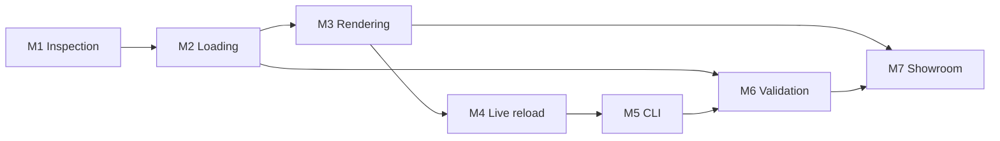

# muxpreview Roadmap

## Current implementation status

The theme inspection foundation and browser inspection iteration now include:

- a React, TypeScript, and Vite application shell
- framework-agnostic theme inspection types
- recursive Node filesystem scanning
- classification of resolutions, scheme files, fonts, glyphs, images, and
  unknown files
- inspection warnings for missing resolutions and common asset folders
- a readable `muxpreview inspect <theme-path>` CLI
- a loopback-only local HTTP server
- `GET /api/theme-inspection`, using the existing inspection service
- a browser dashboard for paths, resolutions, schemes, asset counts, and
  warnings
- resolution-aware discovery and preview of real `image/wall/` assets
- a restricted wallpaper endpoint that serves only inspected candidates
- read-only parsing of scheme sections, keys, values, and source lines
- a resolution-aware Scheme Explorer with scheme selection and filtering
- a restricted scheme endpoint that reads only inspected scheme files
- a reusable fixed-aspect virtual display canvas
- responsive rendering of shared and resolution-specific glyph assets
- glyph selection with source, format, size, and path metadata
- a restricted glyph endpoint that serves only inspected glyph files
- loading and actionable configuration/error states
- build and test tooling

This iteration deliberately does not include:

- scheme value interpretation or merge rules
- full browser theme rendering
- hot reload or filesystem watching
- `.muxthm` package loading

The next iteration should add focused API and browser integration tests, then
move into scheme layering and effective-value provenance. The scanner remains
independent of React.

### Browser inspection decisions and limits

- The server accepts a positional theme path and falls back to
  `MUXPREVIEW_THEME_PATH`.
- The built app and API share one loopback server. During Vite development,
  Vite proxies `/api` to a separately started server process.
- The API currently returns the absolute configured theme path because this
  iteration explicitly requires displaying it. This is acceptable only for
  the loopback-only local dashboard and must be replaced by a display-safe
  path contract before remote access or showroom reuse.
- The endpoint returns the existing `ThemeInspectionResult` directly. A
  versioned protocol DTO remains future work once the contract needs to serve
  more than the local application.
- Browser inspection does not establish any new claim about muOS behavior; it
  presents scanner observations and existing warnings only.

### Wallpaper preview decisions and limits

- Wallpaper discovery is based on the observed
  `<resolution>/image/wall/<file>` structure.
- Every detected candidate remains in the inspection model.
- `default.*` is preferred when present. Otherwise, muxpreview selects the
  first relative path deterministically; this is a preview convention, not a
  verified muOS runtime rule.
- Root-level wallpapers are not assigned to resolutions because the available
  evidence does not establish root-to-resolution fallback behavior.
- The preview preserves the selected resolution's aspect ratio and displays
  the source image without applying scheme values or rendering muxlaunch,
  muxplore, or other interface layers.

### Scheme Explorer decisions and limits

- Scheme parsing is a pure core operation over text supplied by the server.
- The parser recognizes section headers and splits assignments at the first
  `=`. Values remain strings, with both trimmed and original post-separator
  text retained.
- Blank lines and full-line `;` or `#` comments are ignored. Unsupported lines
  are preserved as parse issues with line numbers.
- Duplicate sections and duplicate keys remain in source order.
- The browser shows shared root schemes alongside schemes for the selected
  resolution.
- The explorer does not merge `global.ini`, `default.ini`, or screen-specific
  files and does not claim any value semantics.

### Glyph rendering decisions and limits

- Glyph inventory continues to come from the existing inspection service.
- The selected resolution shows both root-level shared glyphs and glyphs
  explicitly located under that resolution.
- Shared and resolution-specific files are not deduplicated or assigned
  precedence because runtime fallback behavior remains unverified.
- Glyphs are shown in a centered responsive grid over the selected wallpaper
  inside the fixed-aspect virtual display.
- Selection and highlighting belong only to the developer explorer. They do
  not model muOS focus, navigation, or screen state.
- Glyph image dimensions and recolouring remain future work because the
  current scanner records path, format, byte size, and resolution only.

## 1. Roadmap principles

This roadmap turns the architecture into incremental, testable milestones.
Milestones are ordered to reduce compatibility risk before visual complexity.

Each milestone should:

- produce a usable vertical slice
- add tests for its contracts
- preserve unknown muOS behavior as diagnostics or documented assumptions
- avoid implementing work assigned to a later milestone unless required to
  unblock the current one

Dates are intentionally omitted. Estimates should follow an implementation
spike and maintainer capacity assessment.

## 2. Cross-cutting definition of done

Every milestone is complete only when:

- public TypeScript contracts are documented
- errors are actionable
- tests cover the milestone's main path and important edge cases
- private `references/` assets are not copied into distributable output
- no unsupported behavior is presented as verified muOS behavior
- relevant architecture and research documents are updated

## M1: Theme inspection

### Goal

Inventory an unpacked theme directory and present its structure without
attempting to render it.

### Scope

- establish the TypeScript workspace and package boundaries needed for M1
- create the environment-neutral theme model
- implement abstract file-reader contracts
- implement Node filesystem reader for an authorized theme root
- discover:
  - metadata files
  - resolutions
  - scheme files
  - fonts
  - glyphs
  - images
  - overlays
  - sounds
  - alternates
  - catalogue assets
- detect and ignore known non-theme files such as `._*`
- inspect basic file metadata and image dimensions
- detect ZIP-compatible `.muxalt` files by signature
- provide a minimal React/Vite inspection UI
- show parse diagnostics and unsupported file types

### User outcome

A theme author can open muxpreview and answer:

- Was my theme detected?
- Which resolutions and assets are present?
- Which scheme and metadata files were found?
- Are files being ignored or classified unexpectedly?

### Deliverables

- `model`, `parser`, `protocol`, and minimal `node-host` packages
- React/Vite studio shell
- theme overview and file inventory
- deterministic synthetic test themes
- documented parser output

### Exit criteria

- opens every local reference theme directory, including partial themes
- does not fail because metadata is missing
- identifies all six locally observed resolutions
- preserves unknown files in the inventory
- identifies `.muxalt` as ZIP-compatible without claiming all alternates use
  that format
- never sends absolute local paths to the browser

### Explicitly deferred

- scheme merge behavior
- browser theme rendering
- live file watching
- `.muxthm` extraction
- authoritative validation

### Main uncertainties

- case sensitivity expected by target devices
- role of `theme/active`
- archive constraints beyond observed `.muxalt` signatures

## M2: Theme loading

### Goal

Parse schemes and produce an inspectable effective theme context for a selected
resolution, screen, and alternate.

### Scope

- parse INI files while preserving raw values and source positions
- create typed candidates for known colours, alpha, integers, and strings
- preserve unknown sections and keys
- introduce compatibility profile `research-2026-06`
- implement proposed scheme layering as named rules
- implement proposed root/resolution asset lookup as named rules
- load INI alternates
- index packed `.muxalt` contents without executing or trusting them
- expose effective values, overridden values, and provenance
- add resolution, screen, and alternate selectors to the studio
- define versioned API snapshot contracts

### User outcome

A theme author can inspect the effective value of a scheme key and see exactly
which file and compatibility rule selected it.

### Deliverables

- `resolver` package
- scheme inspector
- provenance inspector
- asset resolution inspector
- compatibility profile metadata
- parser/resolver integration tests

### Exit criteria

- partial scheme files merge without requiring a complete schema
- effective values retain all overridden sources
- unresolved assets are reported, not silently discarded
- alternate selection is traceable
- unknown enums remain visible as raw values
- resolver behavior is covered by synthetic golden fixtures

### Explicitly deferred

- claim of exact muOS merge precedence
- complete `.muxthm` loading
- visual rendering
- file watching

### Main uncertainties

- exact scheme merge order
- root versus resolution fallback behavior
- whether active alternates are pre-applied by muOS
- built-in defaults for missing keys

## M3: Browser rendering

### Goal

Render useful, explicitly qualified previews from effective theme data.

### Scope

- create the React renderer package
- establish fixed logical canvases for observed resolutions
- implement preview scaling independent of browser viewport
- implement primitives:
  - background
  - header/status
  - footer/navigation
  - standard list
  - list with image preview
  - grid and current-item label
  - modal/notification
  - bar and counter
- define deterministic fixture scenarios
- load glyphs and images through opaque asset URLs
- support known alpha, colour, border, radius, shadow, and gradient fields
- support image/glyph recolouring where practical
- expose source inspection from rendered elements
- show fidelity warnings for approximate fonts and unknown properties

### User outcome

A theme author can switch among representative screen families, resolutions,
and UI states and see how their files affect the preview.

### Deliverables

- `fixtures` and `renderer-react` packages
- preview canvas and controls
- screen registry
- fidelity panel
- visual regression suite

### Exit criteria

- renders at least one deterministic scenario for each initial presentation
  family
- supports `640x480`, `720x480`, `720x576`, `720x720`, `1024x768`, and
  `1280x720`
- renders focus, disabled, modal, and transient states
- labels browser font rendering as approximate
- unknown screen IDs remain inspectable
- visual tests are stable on the supported test environment

### Explicitly deferred

- `.bin` font decoding
- pixel-perfect claims
- animated/random backgrounds without evidence
- exhaustive rendering of every `mux*` screen

### Main uncertainties

- enum meanings
- compositor layer order
- image fitting and interpolation
- text metrics and long-label behavior

## M4: Live reload

### Goal

Update inspection and rendering automatically when theme files change.

### Scope

- add filesystem watching to the Node host
- debounce and reconcile watcher events
- classify changes by metadata, scheme, asset, alternate, and directory
- introduce snapshot revisions
- add theme-change event protocol
- invalidate parser, resolver, and asset caches
- cache-bust changed browser assets
- preserve studio selections across snapshots
- retain last successful preview when an edit is temporarily malformed
- show connection, reloading, stale, and error states
- measure performance on the large local themes

### User outcome

A theme author can edit an INI or replace an image and see the browser update
without restarting muxpreview.

### Deliverables

- watcher subsystem
- event endpoint
- incremental cache invalidation
- reload status UI
- end-to-end live-reload tests

### Exit criteria

- scheme changes update effective values and preview
- image changes appear without stale browser caching
- file add/remove updates inventory and selectors
- malformed edits produce diagnostics and recover automatically
- watcher bursts produce one coherent snapshot
- UI state is retained unless the selected resource no longer exists

### Explicitly deferred

- collaborative/multi-user editing
- remote filesystem watching
- guaranteed minimal incremental parsing

### Main uncertainties

- acceptable reload latency on very large themes
- platform-specific watcher behavior
- editor save patterns involving rename and replace

## M5: CLI

### Goal

Expose local serving and inspection through a stable command-line interface.

### Scope

- create CLI package and executable
- add commands for:
  - `dev`
  - `inspect`
  - `validate` in preliminary form
- support human-readable and JSON output
- define exit-code policy
- define configuration and argument precedence
- support port and browser-open options
- report server lifecycle and theme summary clearly
- prepare package publishing and executable distribution

### User outcome

A theme author can start muxpreview from a terminal and use inspection output
in scripts.

### Deliverables

- documented CLI
- JSON output schema
- shell-level integration tests
- packaging strategy for supported platforms

### Exit criteria

- `dev <theme>` starts the same Node host used by the studio
- `inspect <theme>` uses the shared parser and model
- JSON output contains no machine-specific absolute paths by default
- invalid arguments and startup failures use documented exit codes
- CLI logic does not duplicate parser, resolver, or validation behavior

### Explicitly deferred

- global configuration file unless a concrete need is established
- archive conversion or packaging commands
- device deployment

### Main uncertainties

- supported Node versions and distribution method
- executable naming conflicts
- whether users need a zero-install binary

## M6: Theme validation

### Goal

Provide trustworthy, reusable diagnostics for authoring and automation.

### Scope

- formalize validation rule registry
- define stable rule IDs and severity policy
- implement rules for:
  - metadata consistency
  - INI syntax
  - known value types and ranges
  - resolution structure
  - missing resources and fallback candidates
  - image dimensions
  - unsupported fonts
  - alternate consistency
  - hidden metadata files
  - unknown enums and screen IDs
  - scenario readiness
- add strict and permissive modes
- support human and JSON CLI output
- add studio filtering and source navigation
- document which rules are reference-backed versus heuristic

### User outcome

A theme author can identify actionable problems before copying a theme to a
device, while still inspecting incomplete or experimental themes.

### Deliverables

- `validation` package
- validation reference documentation
- CLI validation command
- studio diagnostics workflow
- machine-readable report format

### Exit criteria

- parser recovery and validation severity remain separate
- every diagnostic has a stable rule ID and evidence level
- unknown muOS behavior is not reported as an error without evidence
- strictness affects exit policy, not parsed data
- rules are reusable by future showroom ingestion

### Explicitly deferred

- guarantee that a warning-free theme behaves perfectly on hardware
- automatic rewriting of theme files
- device-side validation

### Main uncertainties

- authoritative required files
- official enum ranges
- release-specific schema differences
- target-filesystem case sensitivity

## M7: Public showcase

### Goal

Publish approved theme previews in a public showroom using the shared parser,
validation, fixtures, and renderer.

### Preconditions

M7 should not begin until:

- local rendering is useful and stable
- portable manifests are versioned
- validation can protect ingestion
- theme redistribution and attribution policy is established

### Scope

- create showroom React/Vite application
- define portable theme bundle format
- build isolated archive ingestion
- normalize assets to controlled storage URLs
- generate previews for supported resolutions and scenarios
- display theme metadata, attribution, diagnostics, and fidelity notes
- add search, filtering, and theme detail pages
- define submission, update, removal, and moderation workflows
- establish asset licensing and acceptable-use policy
- add analytics only if justified and privacy-reviewed

### User outcome

Theme authors can share browser previews, and users can explore themes without
installing them on a device.

### Deliverables

- `apps/showroom`
- ingestion worker or pipeline
- portable manifest specification
- storage and deployment architecture
- moderation and licensing documentation
- public theme pages

### Exit criteria

- public rendering uses the same compatibility profile and fixture versions as
  local muxpreview
- untrusted archives cannot escape ingestion limits
- published assets have recorded attribution and permission status
- theme removal and version replacement are supported
- fidelity limitations are visible to visitors
- local filesystem concepts do not leak into showroom manifests

### Explicitly deferred

- community ratings, comments, or accounts unless moderation capacity exists
- in-browser theme editing
- automatic device installation
- monetization

### Main uncertainties

- legal ability to redistribute existing themes
- expected submission volume
- hosting and bandwidth costs
- moderation ownership
- `.muxthm` package format and safety

## 3. Dependency sequence

M6 rule design can begin during M2, but the milestone is complete only after
CLI and studio output are both stable enough to consume it.

## 4. Compatibility checkpoints

At the end of M2, M3, M4, and M6, review the unresolved questions in
`RESEARCH.md`.

For each question:

- record new evidence
- update the compatibility profile
- add or update a regression fixture
- document whether behavior is observed, inferred, approximate, or unknown
- avoid silently changing old profile behavior

## 5. Out of scope for this roadmap

- editing theme files through the browser
- generating `.muxthm` packages
- installing themes on a physical device
- emulating the complete muOS operating system
- executing theme scripts
- decoding fonts without a verified format
- claiming exact device output before hardware/source comparison
- supporting arbitrary third-party plugin execution

These may become future roadmap items after the seven milestones establish a
reliable compatibility foundation.
